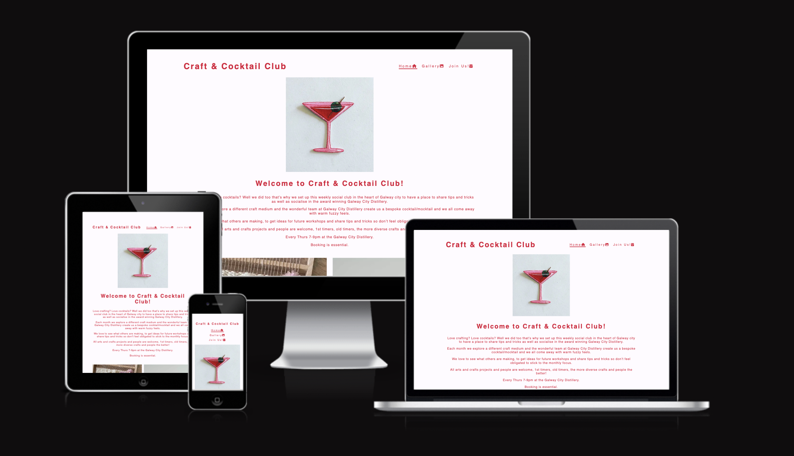
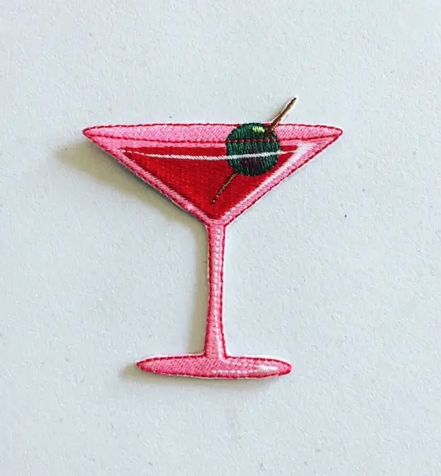
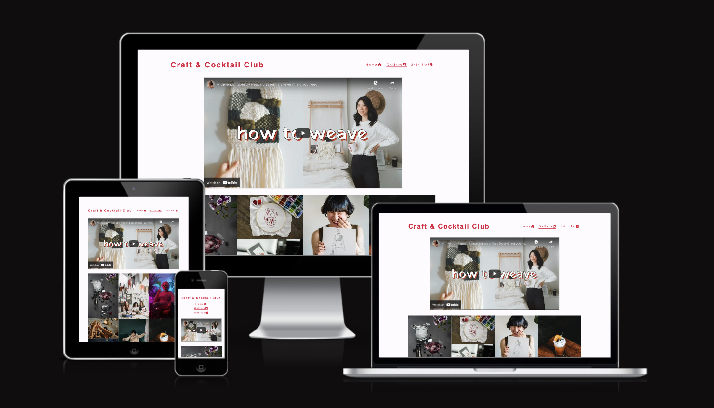
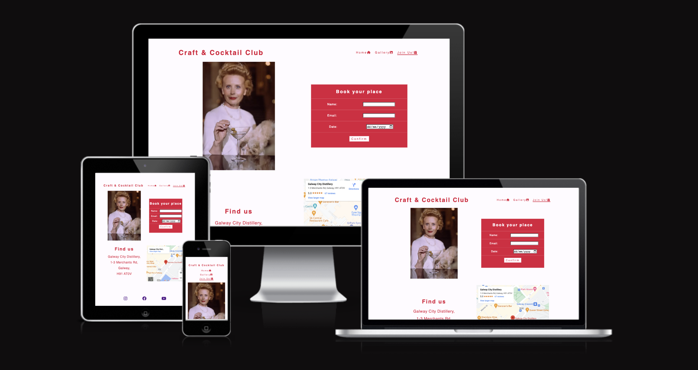

# WELCOME TO CRAFT AND COCKTAIL CLUB.

Craft and Cocktail Club is a webite site for a social arts and crafts club in Galway. It is a hub for information and pictures for its community as well as a platform to attract new members. It is targeted towards arts, crafts, and cocktail entusiasts who enjoy the social aspect of a club and the informal setting of a bar. It will be used for craft and cocktail lovers to book their place on upcoming meetups as well as view the gallery of past meet ups, see what the monthly craft focus is and view a how-to video, and see the bespoke cocktail of the month suggested by the venue- Galway City Distillery.

__
## UX/UI:

Target Audience - Crafters who like to be social.
I wanted a simple design easy to read and navigate but whos images would communicate the most of the club- The images, layout , design amd text all need to convey that it is a fun, enjoyablke atmosphere, with an inclusivivity at the forefront. Peope can see the months craft focus, watch a tutorial and book to join for whatever date that suits. The navigation and site is simple to allow for creative people of all ages who may not be tech savy.

**Site Goals:**

The goal of the site is to act as a community hub of information for its members where they can 
* clearly see what craft the members are focusing on
* what bespoke cocktail has been designed for them
* book their spot on a chosen date
* acts as a source of inspiration and pride - through sharing past work of the mebers,
* a source of knowledge - with a monthly how to video on the chosen topic and a site that captures the spirit of the group. 
* A fun free and welcoming atmosphere to attract new members.

**Colour choice:**

* #DC143C (Crimson)
* #fffbff (Pale pink)

   * Inspired by the color choice of https://annajona.is/ landing page, I wanted the overall feel to be more clean and calm. 
   I chose only one color as the font weights made an impact on the vibrancy of the color and I didn't like that darker reds appeared too brown or purple. I chose a very pale pink background to help with readability.

**Font:**
* Google Fonts - Abril Fatface and Poiret One, sans serif as a back up. They are Elegent, yet not too serious and easily readable especially with the styled letter spacing.

**Imagery:**
 
* As a site targeting creatives I knew spending the time finding the right images would be incredibly important. The chosen imagery sets the tone of the page, the type of craft that is celebrated with the club and the spirit of the community itself. 

**Hero image:** 
* The hero image took me a long time to find but is truly the perfect visual being a hand embroidered cocktail. I do not own the rights to this visual and it is used for educational use only. Credit is in the Credits section.

**Wireframes:**

* Wireframes were made with Balsamiq and can be found [here](assets/wireframes)
I chose not to go with the circular styling as I didnt like the top heavy visual balance on the screen.
I also chose not to float the welcome text or form ontop of the images as I wanted to keep everything simple, clean and easy to read while not compromising the visual language communicated by the images.

____
## FEATURES:

**Nav bar:** 

* The Nav bar consists of 3 options, Home, Gallery, and Join Us! allowing the user to easily navigate their journey without using the back button. 
* Each nav button has an accompanying icon that can be easily read visually.
* The active page is underlined confirming to the user what page they are currently on.
* It is fully responsive with layout of the nav bar is consistent across different screen sizes save for a mobile device.

**Footer:**

* Clickable socail media links allow our members to easily follow us on whatever socials they prefer. 

**Gallery:**

**Instructional video:**

* The Gallery also hosts a how to video on the monthly topic that can allow members to watch and rewatch in their own time. 
    * I do not own the rights to this video- it is being used for educational purposes only. Credit in the Credit section. 
    * [Click here to see video.](https://www.youtube.com/watch?v=m85aQc2n7JA)

**GALLERY IMAGES**

A fully responsive gallery is there to show off peoples achievements and to communicate the fun the group has, the community atmosphere and act as inspiration to attract new members. A mix of craft projects, cocktails, and club members showing a diverse group of people, conveying that this club is inclusive, fun and creative. 

___

**Map:**

A fully responsive google map was added to aid members with physical and visual location. 

**Sign up:**

A sign up form is included welcoming current and new members to book their spot for their chosen date.
___
## TECHNOLOGIES USED:

* Html
* Css
___

## TESTING:
screen shots or links to validators
manual testing with multiple browsers and devices. screenshots.

All clickable links work and the form confirms validation. 

### Logo
    EXPECT: The home page will open when the logo is clicked.
    ACTION: Clicked the logo.
    RESULT: Home page opens when clicked.

### Home button - nav bar
    EXPECT: The home page will open when the button is clicked.
    ACTION: Clicked the home button.
    RESULT: Home page opens when clicked.

### Gallery button - nav bar
    EXPECT: The gallery page will open when the button is clicked.
    ACTION: Clicked the gallery button.
    RESULT: Gallery page opens when clicked.

### Join Us! button - nav bar
    EXPECT: The Join Us! page will open when the button is clicked.
    ACTION: Clicked the Join Us! button.
    RESULT: Join Us! page opens when clicked.

### Form
    EXPECT: The Form will not allow blank fields when the submit button is clicked.
    ACTION: Clicked the submit button with blank field.
    RESULT: Form would not let me submit when clicked. When all fields are filled and submit is pressed, the code is validated.

### Social media links:
    EXPECT: The correct social media page to open in another tab when the button is clicked.
    ACTION: Clicked each social media button.
    RESULT: All three links open open the correct page in a new tab when clicked.

Site was tested on iphone 11 iphone 5 MacBook Air, Ipad, 32" monitor, tested in responsive form in Chrome Dev tools. 

Firefox, Brave, Chrome, Safari

Validator Testing:
* HTML:
    No errors are returned when passing through the official W3C validator.
* CSS:
    No errors are returned when passing throught the official Jigsaw validator.

___
## DEPLOYMENT:
(bullet point walk through of HOW)
cloning and forking
local deployment
remote deployment (live on github pages)

This site was deployed to Github pages. the steps to deploy are :
1. In the github repository, click the settings tab
2. From the source section drop down menu select the main branch
3. Once the main branch has been selected the page will automatically refresh with a detailed ribbon display indicating the successful deployment.

(https://rachel-o-donnell.github.io/craft-and-cocktail-club/)

To Clone this repository follow these steps:

1. On GitHub.com, click into the main page of the repository.
2. Above the list of files, click the drop down Code button
3. Copy the URL for the repository.
    *To clone the repository using HTTPS, under "HTTPS", click .
    *To clone the repository using an SSH key, including a certificate issued by your organization's SSH certificate authority, click SSH, then click .
    *To clone a repository using GitHub CLI, click GitHub CLI, then click .
4. Open Terminal.
5. Change the current working directory to the location where you want the cloned directory.
6. Type git clone, and then paste the URL you copied earlier.
    * $ git clone https://github.com/rachel-o-donnell/craft-and-cocktail-club.git
7. Press Enter to create your local clone.
___
 ## FUTURE FEATURES :

* A back to top button on the bottom of the pages (esp the gallery for phone)
* A booking button on each page for ease of use.

___

## CREDITS:

**Code** I used a variety of sources starting with the Love Running project but adapted to suit my project, styling and design choices. I relied heavily on dev tools to adapt code and problem solve.

* Love running example
    * Meta data: description and keywords. 
    * Core structure for home page
    * Basic nav bar and header structure
    * Logo structure and styling. Changed font family, weights, colors size and letter spacing
    * form
   
* Mobile first design: 
    * Changed logo and nav bar to have mobile first design usin flexbox flex froggy and below video. 
    https://www.google.com/search?q=creating+a+nav+bar+for+mobile+first&oq=creating+a+nav+bar+for+mobile+first+&aqs=chrome..69i57j33i10i160l5.20679j1j7&sourceid=chrome&ie=UTF-8#kpvalbx=_Mn3BYpvUKc-DgQabn5CoCQ29
    * Active nav style
    When I adapted to flexbox I used margin style tips from https://www.youtube.com/watch?v=RSIclWvNTdQ to remove the space I had created beneath my Nav item and its active page underline.

* Responsiveness
    * styling image for responiveness (flexbox) used W3 to help with syntax of inserting into html and a combo of below links to style 
    https://www.google.com/search?q=creating+a+nav+bar+for+mobile+first&oq=creating+a+nav+bar+for+mobile+first+&aqs=chrome..69i57j33i10i160l5.20679j1j7&sourceid=chrome&ie=UTF-8#kpvalbx=_Mn3BYpvUKc-DgQabn5CoCQ29

     * https://www.google.com/search?q=how+to+make+mobile+first+website&oq=how+to+write+mobile+first+&aqs=chrome.2.0i512j69i57j0i22i30j0i10i22i30j0i22i30l3j0i15i22i30j0i390l2.16112j0j7&sourceid=chrome&ie=UTF-8#fpstate=ive&vld=cid:71362564,vid:XsEnj-1hG2o,st:0

* Grid for monthly focus
   * https://www.youtube.com/watch?v=RSIclWvNTdQ

* Footer - style using the nav bar info along with flexbox froggy to style.
    * https://flexboxfroggy.com/

* Inserting you tube video:    
    * https://www.youtube.com/watch?v=ly36kn0ug4k - couldnt remeber how to paste a you tube video.
    * https://www.youtube.com/watch?v=9YffrCViTVk making the video responsive.
    * added a margin to separate the video from the gallery images and nav bar

* Creating and styling a flexbox form
    * https://webdesign.tutsplus.com/tutorials/building-responsive-forms-with-flexbox--cms-26767

* Markdown 
    * format learnings from below
        * https://www.youtube.com/watch?v=HUBNt18RFbo
        * https://www.markdownguide.org/cheat-sheet/ 

* Responsive Google maps
    * https://blog.duda.co/responsive-google-maps-for-your-website - changed to suit my project

* Media query
    * Ideas from here- using rem/em 
        * https://www.youtube.com/watch?v=IsC5-C_nuF4
        * https://www.w3schools.com/tags/ref_pxtoemconversion.asp - px converter - converting standard screen px sizes to ems.
        * https://freshman.tech/flexbox-navbar/ - adjusting the navbar in flexbox to get it against left and right sides.

**Media**

**Saving and optimizing images for SEO** 
    https://www.jimdo.com/blog/optimize-website-images-for-better-design-seo/

* Hero image
    * Red embroidered cocktail https://www.etsy.com/uk/listing/663300271/pink-martini-iron-on-patch-olive Credit: kindersticker on etsy.

* Youtube video
    * Credit withwendy: tapestry weaving essentials (everything you need)

**Gallery**
    * All images from Pexels.
    * Photo by Tim Gouw: craft-neon
    * Photo by Karolina Grabowska: drawing-supplies
    * Photo by Michael Burrows: laughing-girl-drawing
    * Photo by cottonbro: flower-illustration, guy-with-wool, woman-with-martini, cheers-with-confetti
    * Photo by Pavel Danilyuk: girls-in-class
    * Photo by Pexels User: crochet-bag
    * Photo by Miriam Alons: woman-with-knitting
    * Photo by Godisable Jacob: embroidered-bag
    * Photo by Magdaline Nicole: embroidered-heart
    * Photo by RODNAE Productions: party-scene
    * Photo by Mix and Match Studio: orange-rosemary-cocktail
    * Photo by Marcelo Verfe: blueberry-cocktail
    * Photo by Ron Lach: neon-woman
    * Photo by Luciann Photography: neon-cocktail-sign
    * Photo by Nadin Sh: passion-fruit-cocktail
    * Photo by Dziana Hasanbekava: new monthly cocktail

___

## BUGS FIXED:

* Nav bar not flush with side in bigger screen- removed margin in media query
* Images sticking to the left after resizing- added display flex
* Added containers around map to fit in flex display
* img - width 100% instead of max-width
* Video container - #video-container/ #video.container , also had missed the @media query tag to change the size.
* Form with flexbox - had to undo lots of styling to uncover my mistake. I needed to add 50% with to #form
* Images joined together on home page - added margin

___
## RESOURCES USED:
Stack Overflow
Google
W3 Schools
Balsamiq 
Youtube
Devtools
Flex froggy
Google maps
Ezgif.com - to compress images/convert to webp
___